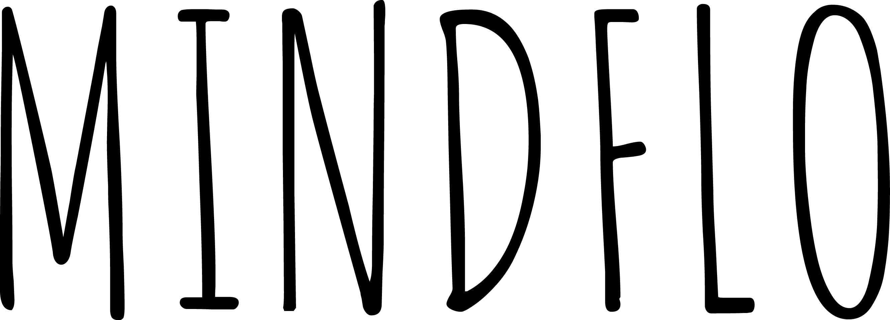

# MINDFLO

A visual and interactive application for individuals to track their day to day lives - habits, behaviors, emotions, moods, physical symptoms - in a colorful grid format.


## Features

- Tracking Grid
  - At a specified time each day, users will be sent a reminder to complete their daily reflection
  - Users will input information on day's habits, behaviors, emotions, moods, physical symptoms
    - Tracks pre-selected topics (during onboarding, ask users to select categories they are concerned about and tailor tracking topics to them)
      - ex/ if they are female, can track cycle
    - Also tracks topics input by users
    - Users can set location (from which we can get info about time zone, weather and autofill in grid)
    - Topics are tracked in different methods
      - Yes / No
      - Scale (i.e. how anxious did you feel today 1-10)
      - Numeric (i.e. weather details such as amount of sunlight, hours of sleep/exercise/tv)
  - Users can zoom in (see single days) and zoom out (see 1 week, 2 weeks, month, year, etc), or just view one topic across time
  - Various pre-made color schemes to choose from
- Done List
  - Prompt user to reflect on the day and list a few personal triumphs
- Playground
  - Select elements to be be tested for correlation
  - Diagram to display regression analysis of those selected elements

## Future

- Offer tailored insights to users
- Integrate with google calendar

## Installation

To install JS dev dependencies (listed in [package.json](package.json)):

```bash
npm install
```

## Code

Javascript files will compile using babel/webpack by running:

```bash
npm run build
```

or in watch mode

```bash
npm run dev
```

## View

To view, open the following in your browser:

```bash
localhost:8080
```
